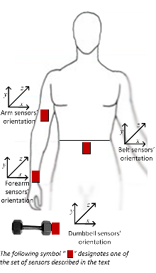

## Executive summary

**Context:** 
This is a Machine Learning project, from Data Science Specialization. We have personal weight lifting data of 6 different people (courtesy of: [Groupware-LES Human Activity Recognition](http://groupware.les.inf.puc-rio.br/har)), read by personal sport devices (like Jawbone Up, Nike FuelBand or Fitbit). 

**Question** is: what class of exercise people are doing, having sport devices data?.
This is a **supervised** learning machine algorithm, because we know data and outcome in dataset. Having a cualitative output, this is a **clasification** task.

**Conclusions:** 
 - Data can are enough and well distributed, can answer the question. 

***

### Dataset description
Using devices such as Jawbone Up, Nike FuelBand, and Fitbit it is now possible to collect a large amount of data about personal activity relatively inexpensively. These type of devices are part of the quantified self movement - a group of enthusiasts who take measurements about themselves regularly to improve their health, to find patterns in their behavior, or because they are tech geeks. One thing that people regularly do is quantify how much of a particular activity they do, but they rarely quantify **how well they do it**. 
In this project, our goal will be to use data from accelerometers on the belt, forearm, arm, and dumbell of 6 participants. They were asked to perform barbell lifts correctly and incorrectly in 5 different ways, as we see in variable "classe".
 - exactly according to the specification (Class A)
 - throwing the elbows to the front (Class B), 
 - lifting the dumbbell only halfway (Class C), 
 - lowering the dumbbell only halfway (Class D) 
 - and throwing the hips to the front (Class E).
  


Reading the dataset
```{r, cache=T}
data <- read.csv("https://d396qusza40orc.cloudfront.net/predmachlearn/pml-training.csv", sep = ",", na.strings = c("", "NA"))
validation  <- read.csv("https://d396qusza40orc.cloudfront.net/predmachlearn/pml-testing.csv", sep = ",", na.strings = c("", "NA"))
```

We have abundant data  (`r dim(data)[1]` samples). Samples are well distributed over 6 users and 5 classes.
```{r, message=F, warning=F}
table(data$user_name,data$classe)
```


***
### Pre-processing
cleaning data
```{r, message=F, warning=F, cache=T}
data <- data[, colSums(is.na(data)) == 0] 
validation <- validation[, colSums(is.na(validation)) == 0] 
```

Remove columns "X", "timestamp", "window"
Remove no-numeric variables
```{r}
classe <- data$classe  #reserve classe

dataRemove <- grepl("^X|timestamp|window", names(data))
data <- data[, !dataRemove]
data2 <- data[, sapply(data, is.numeric)]
data2$classe <- classe

validationRemove <- grepl("^X|timestamp|window", names(validation))
validation <- validation[, !validationRemove]
validation2 <- validation[, sapply(validation, is.numeric)]
```


Splitting data into training and testing
```{r, message=F, warning=F}
library(caret)
set.seed(1)
inTrain = createDataPartition(data2$classe, p = 3/4)[[1]]
training = data2[inTrain, ]
testing = data2[-inTrain, ]
```

In training dataset we have `r dim(training)[1]` samples over `r dim(training)[2]` variables. In testing we have `r dim(testing)[1]` samples.


### Model training

Train decision tree
```{r, message=F, warning=F, cache=T}
library(caret)
mod_tree <- train(classe ~ ., data = training, method = "rpart")
```

Train random forest
```{r, message=F, warning=F, cache=T}
library(caret)
mod_rf   <- train(classe ~ ., data = training, method = "rf") 
```

Train boosting with trees
```{r, message=F, warning=F, cache=T}
library(caret)
mod_gbm   <- train(classe ~ ., data = training, method = "gbm")  
```

Train linear discriminant analysis
```{r, message=F, warning=F, cache=T}
library(caret)
mod_lda   <- train(classe ~ ., data = training, method = "lda")  
```


Predict with all models and test accuracy
```{r}
# Accuracy using trees
pred_tree  <- predict(mod_tree, testing)
confusionMatrix(pred_tree, testing$classe)$overall[1]

# Accuracy using random forests
pred_rf  <- predict(mod_rf, testing)
confusionMatrix(pred_rf, testing$classe)$overall[1]

# Accuracy using boosted trees
pred_gbm <- predict(mod_gbm, testing)
confusionMatrix(pred_gbm, testing$classe)$overall[1]

# Accuracy using linnear discriminant analysis
pred_lda <- predict(mod_lda, testing)
confusionMatrix(pred_lda, testing$classe)$overall[1]

# Accuracy using the lasso
pred_lass <- predict(mod_lass, testing)
confusionMatrix(pred_lass, testing$classe)$overall[1]
```


```{r}

```

